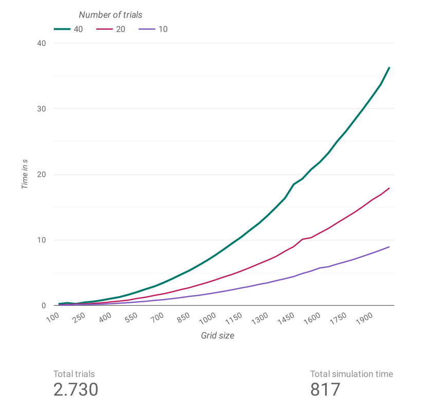

# Assignment 1 - Percolation

Grade: 100%  
[Specification](http://coursera.cs.princeton.edu/algs4/assignments/percolation.html)

## Graded files

- [Percolation.java](./src/main/java/Percolation.java)
- [PercolationStats.java](./src/main/java/PercolationStats.java)

## Analysis of running time and memory usage (bonus task)

[RuntimeStats.java](./src/main/java/RuntimeStats.java)

This task is optional and not graded. 

It is intuitve that doubling the number of trials `t` doubles the running time as the same work is performed twice as often. 
Doubling the grid size `n` increases the running time polynomially. 

The visualisation was created with Google Data Studio.